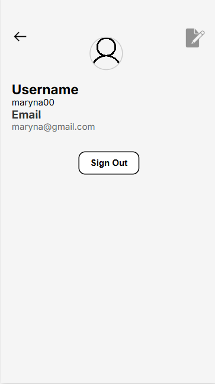

# Walk Explorer
### Project Overview:
 Wrocław Walk Explorer is an interactive progressive web-app platform designed to help users plan personalized walking routes around the city of Wrocław, with potential for expansion to other cities. Users can customize their walks based on the amount of time they have, the type of walk they prefer (e.g., cultural, nature-focused), and specific interests (e.g., cafes, historical sites, parks). The platform generates optimized routes on the map with recommended stops, providing a unique and tailored experience for both residents and visitors.

### Target Audience:

Visitors to Wrocław looking to explore the city in a tailored manner.
Locals seeking to discover new parts of their city or enjoy themed walks (e.g., cultural, nature, food-related).
Individuals planning events like guided tours or thematic walks.

### Core Features:

* Personalized Route Creation: Based on user preferences, the system creates multiple walking routes using Wrocław’s map data.
* Optimized Stopping Points: Each route features optimized stopping points (e.g., popular cafes, architectural landmarks, parks, theaters) that align with the user's interests and time constraints.
* Interactive Map: The map highlights the suggested routes and provides information about each stop. Users can zoom in for more details and click on each point for additional info (e.g., opening hours, historical background).
* User Feedback: Users can rate their walks and leave reviews or comments about specific stops to enhance recommendations for future users.
Favorites and Sharing: Users can save their favorite routes and share them with others.

## Tech Stack
   * Frontend:

       * React
       * Formik
       * Yup
   * Backend:

       * Python
       * Django
       * Django REST Framework
   * APIs:

       * OpenAI API
       * Mapbox API
       * Google Maps API
## Installation Guide

### Prerequisites

- Python 3.12

### Steps

1. **Clone the repository:**
   ```sh
   git clone https://github.com/borovykmary/WalkExplorer
   ```

2. **Create A virtual environment:**
    ```sh
    python3.12 -m venv venv
    source venv/bin/activate  # On Windows: venv\Scripts\activate
    ```

3. **Install the required packages:**
    ```sh
    pip install -r requirements.txt
    ```

4. **Add your api keys:**
    Create a .env file in the we_backend directory and add your api keys:
    ```sh
    DEBUG=True
    SECRET_KEY=your_secret_key
    DATABASE_URL=your_db_url
    MAPBOX_TOKEN=your_mapbox_api_key
    OPENAI_API_KEY=your_openai_api_key
    GOOGLE_MAPS_API_KEY=your_google_maps_api_key
    ```

5. **Run the application:**
    ```sh
    python manage.py runserver
    npm start
    ```
### Authors:
Maryna Borovyk, Illia Pastushok, Sofiia Tretiak
## Demonstration
### Screenshots:
|  |  |
|:---------------------------------:|:------------------------------------:|
|  |  |
|  |  |
|  |  |
